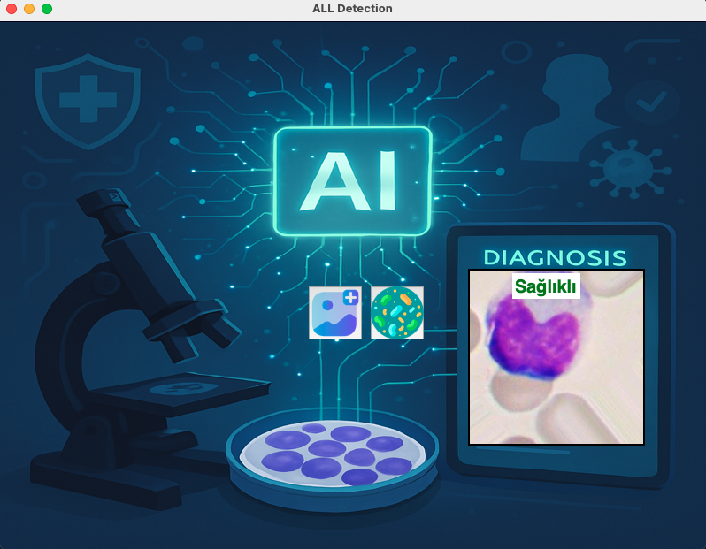
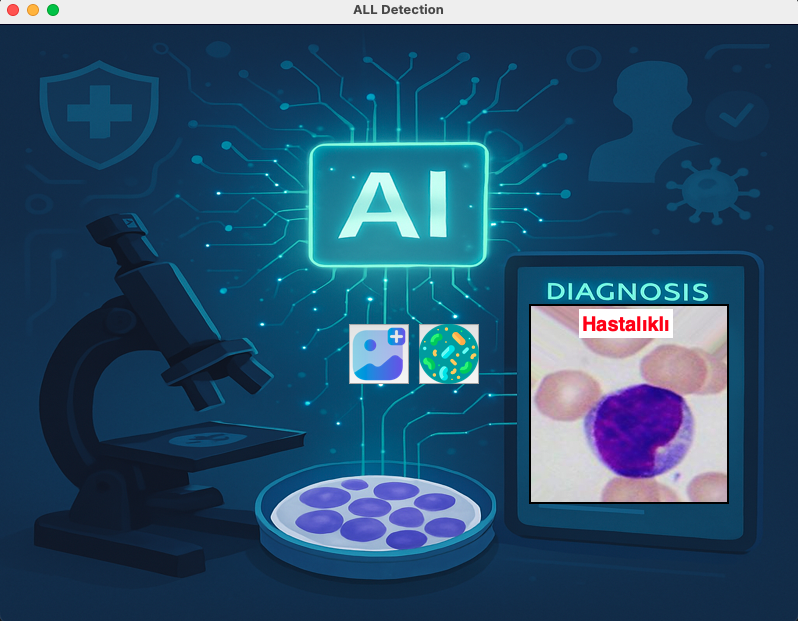

ALL Detection with YOLOv8 Classification

This project is an AI application that detects Acute Lymphoblastic Leukemia (ALL) from microscope blood cell images using a YOLOv8 classification model.

📁 Project Structure

1. Dataset

Images are sourced from the ALL-IDB2 dataset.

A CURL filter was applied to enhance image clarity.

Data augmentation techniques were used (rotation, flipping, brightness, etc.).

2. Model

The YOLOv8 classification mode was used to train the model to distinguish two classes:

Hastalıklı (Diseased)

Sağlıklı (Healthy)

The trained model is saved as a .pt file and directly used in the GUI.

3. GUI (Graphical User Interface)

Built with Tkinter in Python.

The user can:

Select an image

Click the predict icon

The system displays the diagnosis result in color-coded text on the screen.

4. GUI Screenshots

✅ Healthy

⚠️ Diseased

